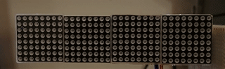

<!DOCTYPE html>
<html>
  <head>

  <body>
    <h1>ESP32StockTicker</h1>
    </img>
    <h3><u>Summary</u></h3>
    
ESP32 based stock ticker that uses a MAX7219 LED Matrix (mine is 4
      segments but how many is up to you), that receives the ticker symbol from
      self served webpage.

    
I am currently using Yahoo Finance for price info every 5 seconds but you
      can change that to the API of your choice along with the update frequency.

    
This code utilizes both cores, without doing so causes a pause when
      prices get updated.  Technically should work on ESP8266 with changes. (and it is single core)

  
The ESP8266 needs the RSA fingerprint method: http.begin(server,"74:79:EA:92:97:56:A5:C7:94:9B:2C:DD:97:B4:64:15:4F:23:F7:FF");

    
I am not a developer or programmer, so my code is not pretty, but it
      works and I work on it all the time. 

    
This code is compatible with Arduino and PlatformIO.

    <h3><u>Libraries Used:</u></h3>
    
<a href="https://github.com/bartoszbielawski/LEDMatrixDriver" target="_blank">LEDMatrixDriver</a>
      by <a href="https://github.com/bartoszbielawski" target="_blank">Bartosz
        Bielawski</a> 
      <a href="https://github.com/me-no-dev/ESPAsyncWebServer" target="_blank">ESPAsyncWebServer</a>
      by <a href="https://github.com/me-no-dev" target="_blank">Me No Dev</a> 
  <a href="https://github.com/bblanchon/ArduinoJson">ArduinoJson</a>

    <h3><u>Setup</u></h3>
    
My personal ESP32 setup is as follows:

   <table>
<thead>
  <tr>
    <th>ESP32 Pins</th>
    <th>LED Matrix</th>
  </tr>
</thead>
<tbody>
  <tr>
    <td>3.3V</td>
    <td>VCC</td>
  </tr>
  <tr>
    <td>GND</td>
    <td>GND</td>
  </tr>
  <tr>
    <td>23</td>
    <td>DIN</td>
  </tr>
  <tr>
    <td>15</td>
    <td>CS</td>
  </tr>
  <tr>
    <td>18</td>
    <td>CLK</td>
  </tr>
</tbody>
</table>
    
You must insert your own SSID and password for your Wifi, so it can
      connect. 

    
Upon getting an IP address it will display it continually on the LED
      Matrix until it receives its first ticker symbol.

    
From any browser input the IP address where you will be presented with a
      ticker input. 

    
The program will automatically check for a new price every 5 seconds.

    
It also supports crypto, but you must use the Yahoo Finance format, for
      example BTC-USD for Bitcoin.

    
Any symbol that works on Yahoo Finance should technically work.

  
I got JSON working finally, so it now works a little better.

    
 

<b>Updated 4/1/2021</b> - Finally got ArduinoJSON working and tried to make the code more readable.
 
    

  <h3><u>FAQ</u></h3>
  
<b>What happens when I put a bad ticker? Like "None"?</b> 
  Core 1 has a fit and panics, causing the ESP32 to restart.

  </body>
</html>
